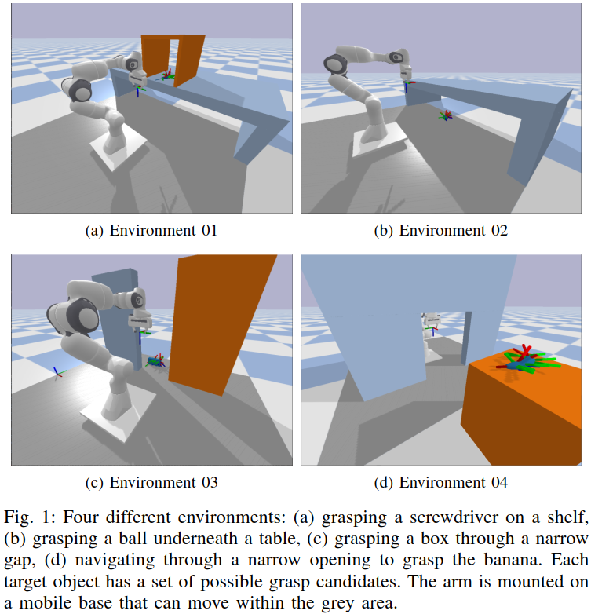

# A framework for joint grasp and motion planning in confined spaces

This is a work by Martin Rudorfer, Jiri Hartvich, Vojtech Vonasek (Aston University, Birmingham, UK & Czech Technical University, Prague, CZ) and currently under review at RoMoCo'24.

_**Abstract:**_
Robotic grasping is a fundamental skill across
all domains of robot applications. There is a large body of
research for grasping objects in table-top scenarios, where
finding suitable grasps is the main challenge. In this work,
we are interested in scenarios where the objects are in confined
spaces and hence particularly difficult to reach. Planning how
the robot approaches the object becomes a major part of the
challenge, giving rise to methods for joint grasp and motion
planning. The framework proposed in this paper provides
20 benchmark scenarios with systematically increasing diffi-
culty, realistic objects with precomputed grasp annotations, and
tools to create and share more scenarios. We further provide
two baseline planners and evaluate them on the scenarios,
demonstrating that the proposed difficulty levels indeed offer a
meaningful progression. We invite the research community to
build upon this framework by making all components publicly
available as open source.

The components can be found in the following repositories:
- [github.com/mrudorfer/jogramop-framework](https://github.com/mrudorfer/jogramop-framework) - benchmark scenarios & scripts for scenario creation, visualization, and evaluation (Python)
- [github.com/Hartvi/Burs](https://github.com/Hartvi/Burs) - the baseline planners (C++)

